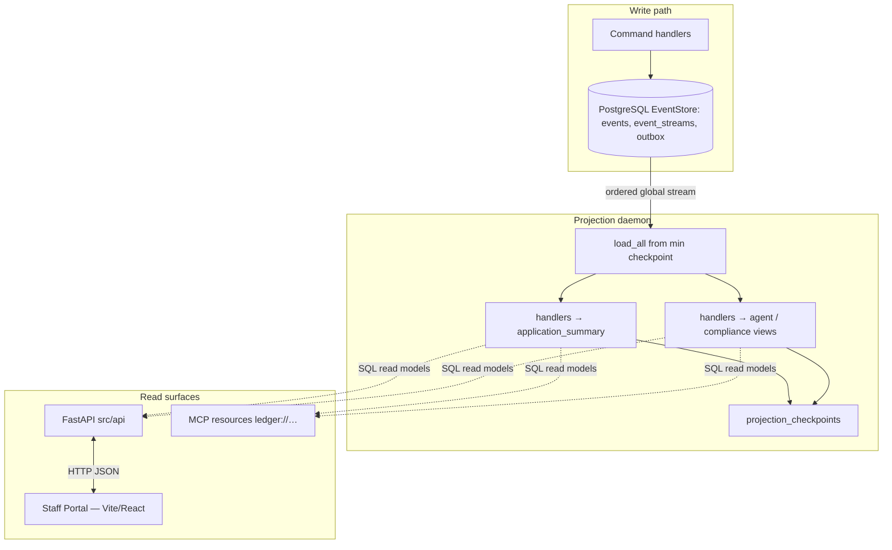

# The Ledger — Implementation Report

**Author:** Hiwot Beyene  
**Project:** Apex Fintech event-sourced loan decision platform (“The Ledger”)  
**Purpose:** This document explains the architecture as implemented in the repository today, how write-side aggregates and PostgreSQL (or in-memory) event storage relate to projections, HTTP APIs, the Staff Portal frontend, and the MCP server, and how automated tests demonstrate concurrency, projection health, upcasting, integrity, regulatory packaging, and counterfactual replay.

---

## How to capture evidence (screenshots)

Each major section below lists **evidence commands** you can run from the repository root. Run the command in a terminal, wait for pytest to finish, and take a screenshot of the window showing the **`PASSED`** summary line (and, where noted, the printed evidence block). The checklist at the end gathers every command in one place so you can walk through the report in order.

---

## 1. Introduction

The system treats the **append-only event log** as the system of record. Business changes are expressed as versioned events appended to named streams with **optimistic concurrency** on `event_streams.current_version`. **Command handlers** in `src/commands/handlers.py` are the supported way to emit those events: they replay aggregates, enforce invariants, then call `EventStore.append`. **Read models** are built by **projection handlers** that consume the global event stream and upsert SQL tables such as `application_summary` and `compliance_audit_current`, tracked by `projection_checkpoints`. The **Staff Portal** (`portal/`, React and Vite) is a staff-facing UI that reads the same reality through **`src.api`** when `VITE_API_URL` points at the API base URL; it does not bypass the store. **Ledger MCP** (`src/mcp/server.py`, runnable via `scripts/run_mcp_server.py`) exposes the same command and query semantics as structured **tools** and **resources** for automation and demos. This report ties those pieces together and points to tests that prove the critical properties.

---

## 2. Architecture

### 2.1 Event store schema and transactional append

The relational layout is defined in `src/schema.sql` and applied in order by `src/migrations/001_event_store.up.sql`. The **`events`** table stores each fact with `stream_id`, per-stream `stream_position`, monotonic `global_position`, `event_type`, `event_version`, JSON `payload` and `metadata`, and `recorded_at`. The uniqueness constraint on `(stream_id, stream_position)` ensures at most one committed event at each position. **`event_streams`** holds one row per stream with `current_version` used for **compare-and-swap** on append. **`outbox`** rows are written in the **same transaction** as new `events` rows, with a foreign key from `outbox.event_id` to `events.event_id`, so downstream publishers can implement at-least-once delivery without guessing which commits included which notifications. **`projection_checkpoints`** records the last processed `global_position` per projection name so daemons can restart without double-applying handlers. Additional tables populated by projections (for example `application_summary`, `compliance_audit_current`, `agent_session_index`) are part of the read model, not alternate write paths.

### 2.2 Aggregate boundaries

Each aggregate instance is identified by a **single stream id** convention so concurrent writers contend only when they legitimately target the same aggregate:

| Aggregate (concept) | Stream pattern | Representative events |
|---------------------|----------------|------------------------|
| Loan application | `loan-{application_id}` | `ApplicationSubmitted`, `CreditAnalysisCompleted`, `DecisionGenerated`, `HumanReviewCompleted`, `ApplicationApproved`, terminal states including final approval |
| Agent session (“Gas Town”) | `agent-{agent_id}-{session_id}` | Context load, session lifecycle, agent outputs bound to a session |
| Compliance record | `compliance-{application_id}` | Compliance initiation and completion with evidence |

Command handlers load each aggregate by **replaying only its stream**, apply domain rules (state machine transitions, session ordering, model versions, confidence floors, compliance prerequisites, causal chains on decisions), then append new events with the correct `expected_version`.

### 2.3 Projection data flow and frontend consumption

The **`ProjectionDaemon`** in `src/projections/daemon.py` (with handlers in `application_summary.py`, `agent_performance.py`, `compliance_audit.py`) pages through **`load_all`** starting from the minimum checkpoint across registered projections, dispatches each event to registered handlers, upserts read-model tables, and advances checkpoints atomically with processing. **Lag** is expressed as how far behind the head of the global stream a projection is; **`get_health`** exposes per-projection lag, `max_projection_lag`, and a boolean **`slo_projection_catchup_ok`** compared to a configurable ceiling (for example **`LEDGER_PROJECTION_MAX_LAG_EVENTS`**, with tests overriding via `slo_max_lag_events`). The **FastAPI** app under `src/api` serves JSON endpoints (pipeline, summaries, compliance, navigator-style queries) that read those SQL projections when present. The **Staff Portal** consumes that HTTP API for intake and pipeline screens, so operators see the same derived state that MCP resources read through **`SqlProjectionQueries`** rather than ad hoc stream scans for dashboards.

### 2.4 MCP tool and resource mapping

**Tools** are implemented on **`LedgerMCPService`** in `src/mcp/server.py` (names documented in `src/mcp/tools.py`). **`build_fastmcp_server`** registers those tools for stdio MCP clients, and **`scripts/run_mcp_server.py`** wires a live **`EventStore(DATABASE_URL)`** and runs the server loop. **Resources** in `src/mcp/resources.py` resolve URIs through a **`ProjectionQueryPort`**: examples include `ledger://applications/{id}` for summary rows, compliance and audit-trail views keyed by application, agent session material, and **`ledger://ledger/health`** for projection lag and MCP latency or error counters including **`slo_projection_catchup_ok`**. Tool responses use structured error shapes (`error_type`, `message`, `suggested_action`, `context`).

**Evidence commands**

- Schema and migration consistency: `python -m pytest tests/phase1/test_schema_migrations.py -v`
- Projection daemon behavior and health SLO field: `python -m pytest tests/phase3/test_projection_daemon.py -v`

---

## 3. Concurrency and service-level objectives

### 3.1 Double-writer behavior (optimistic concurrency)

When two writers append to the **same** stream with the **same** `expected_version`, the database conditional update on `event_streams.current_version` allows **at most one** commit. The other writer receives **`OptimisticConcurrencyError`** with structured `expected_version` and `actual_version`. This pattern avoids destructive merge conflicts at the persistence boundary while forcing the application to reload and retry consciously. The in-memory test **`tests/phase1/test_concurrency.py::test_double_decision_concurrency_collision`** races two `append` calls after a three-event setup, then asserts there are exactly four events afterward (never five), exactly one append succeeds, exactly one raises **`OptimisticConcurrencyError`**, and the winning **`CreditAnalysisCompleted`** lands at **`stream_position == 4`**. Running with **`-s`** prints a labeled **OCC evidence** block before assertions so the console transcript is easy to screenshot. When **`APEX_LEDGER_TEST_DB_URL`** or **`DATABASE_URL`** points at a live PostgreSQL instance, **`tests/phase1/test_event_store.py::test_double_decision_occ_collision_postgres`** exercises the same idea against the real store (`pytest -m postgres_integration`).

### 3.2 Projection lag and SLO signaling

The repository does not ship a separate load-generator benchmark; instead, **`tests/phase3/test_projection_daemon.py::test_daemon_get_health_exposes_lag_slo`** installs a **fake projection** that reports a fixed lag of **50,000** events and calls **`get_health(slo_max_lag_events=100)`**. The test asserts **`slo_projection_catchup_ok is False`**, which shows that operational health can flip when lag exceeds the ceiling. That is how you would wire alerting: the bit is testable without running production traffic, and the MCP health resource surfaces the same concept for observers.

### 3.3 Retry budget (transient DB errors versus OCC)

PostgreSQL **`EventStore`** wraps eligible operations in **`_run_with_db_retry`** with defaults such as **`db_retry_max_attempts = 3`**, exponential backoff between **`db_retry_base_delay`** and **`db_retry_max_delay`**, and classification so that **transient** errors (for example deadlocks) may be retried while **`OptimisticConcurrencyError` is never** treated as transient. A lost OCC race therefore does not disappear through blind retries inside the store; the caller must reload the aggregate and decide policy. **`tests/phase1/test_event_store_retry.py`** demonstrates successful completion after a simulated transient failure and confirms OCC does not loop. **`ProjectionDaemon`** uses its own per-handler **`max_retries`** before skipping poison-pill events, and **`LedgerMCPService`** caps tool-level OCC replays with **`max_occ_retries`**. If each independent attempt fails with probability **p**, an **n**-attempt cap leaves a residual tail probability of **p^n**, which is the quantitative story documented in **`DESIGN.md`** for reviewers who want numbers beside the code.

**Evidence commands**

- OCC collision with printed evidence: `python -m pytest tests/phase1/test_concurrency.py::test_double_decision_concurrency_collision -v -s`
- In-memory OCC variant: `python -m pytest tests/phase1/test_phase1_event_store.py::test_double_decision_occ_collision_exactly_one_wins -v`
- PostgreSQL OCC (skips if the database is unreachable): `python -m pytest tests/phase1/test_event_store.py::test_double_decision_occ_collision_postgres -v -m postgres_integration`
- Projection SLO on health: `python -m pytest tests/phase3/test_projection_daemon.py::test_daemon_get_health_exposes_lag_slo -v`
- Database retry behavior: `python -m pytest tests/phase1/test_event_store_retry.py -v`

---

## 4. Upcasting and integrity

### 4.1 Read-time upcasting and immutability of stored rows

Older **`CreditAnalysisCompleted`** events may exist at **`event_version == 1`** with a thinner payload. On **read**, the **`UpcasterRegistry`** in `src/upcasting/registry.py` plus built-ins from `src/upcasting/upcasters.py` materializes a logical newer shape (for example inferred fields and explicit `None` where confidence was not recorded) so replay and handlers see a consistent model. **Stored database rows must not be rewritten** when a client reads: the PostgreSQL integration test **`tests/phase4/test_upcasting.py::test_upcast_is_read_time_only_and_does_not_mutate_stored_row`** compares the raw `events` row before and after **`load_stream`** and confirms **`event_version`** and JSON **`payload`** in the table are unchanged while the in-memory **`StoredEvent`** reflects the upcasted view. **`InMemoryEventStore`** follows the same contract by applying upcasters only on read paths.

### 4.2 Hash chain verification and tamper detection on the entity stream

**`src/integrity/audit_chain.py`** implements **`verify_audit_chain`** and **`run_integrity_check`**, which append **`AuditIntegrityCheckRun`** events on **`audit-{entity_type}-{entity_id}`** with rolling **`integrity_hash`** values over canonicalized event bytes consistent with regulatory packaging. **`tests/phase4/test_integrity.py::test_integrity_chain_detects_tampering`** runs an honest check, mutates a stored payload in the in-memory store to simulate tampering, and asserts the subsequent check reports **`chain_valid is False`** and **`tamper_detected is True`**, with the latest audit payload reflecting the failure.

### 4.3 Regulatory package and receiver-side verification

**`generate_regulatory_package`** in `src/regulatory/package.py` (replay helpers in `src/what_if/projector.py`) builds an examination-time bundle: full event materialization, projection snapshots as of the examination timestamp, narrative lines, causal links, AI trace fields, and **`audit_integrity`** including **`tamper_detected`**. **`tests/phase6/test_time_travel.py::test_generate_regulatory_package_flags_tamper_when_audit_chain_breaks`** establishes a baseline integrity check, mutates loan history, and asserts the package reports tampering and a broken chain. **`verify_regulatory_package`** recomputes **`package_sha256`** over the canonical JSON body so a third party can detect tampering with the file after export; **`tests/phase6/test_time_travel.py::test_verify_regulatory_package_fails_when_body_tampered`** covers that path.

**Evidence commands**

- Postgres upcast immutability: `python -m pytest tests/phase4/test_upcasting.py::test_upcast_is_read_time_only_and_does_not_mutate_stored_row -v -m postgres_integration`
- Upcasting suite (in-memory paths): `python -m pytest tests/phase4/test_upcasting.py -v`
- Integrity chain: `python -m pytest tests/phase4/test_integrity.py -v`
- Regulatory tamper and package hash verification: `python -m pytest tests/phase6/test_time_travel.py -v`

---

## 5. MCP lifecycle (service surface equivalent to MCP tools)

End-to-end coverage does not require a live stdio MCP client: **`tests/phase5/test_mcp_lifecycle_integration.py::test_full_application_lifecycle_via_mcp_service_only`** drives **`LedgerMCPService`** directly, which is the same code path MCP tools call. The trace submits an application, requests credit analysis, starts and records a credit agent session, records fraud screening, initiates and records compliance, generates a decision with a contributing session reference, completes human review with an approval outcome, then asserts **`FINAL_APPROVED`** (or equivalent terminal approval state) and reads **resources** for application summary, compliance, audit trail, agent session, and health. That demonstrates the loan path from intake through final approval using only the MCP service API surface.

**Evidence command**

- Full lifecycle via MCP service: `python -m pytest tests/phase5/test_mcp_lifecycle_integration.py::test_full_application_lifecycle_via_mcp_service_only -v`

---

## 6. Bonus scenarios (counterfactuals and credit-tier hint)

**`run_what_if`** branches a timeline at a chosen `branch_at_event_type`, applies synthetic counterfactual events anchored to the branch, strips or retains downstream events according to causal dependency analysis, and compares replayed projection snapshots between the real and counterfactual timelines. **`tests/phase6/test_time_travel.py::test_run_what_if_changes_risk_tier_in_projection`** shows a different **`CreditAnalysisCompleted`** outcome changing **`application_summary.risk_tier`** in the replay projection. **`src/what_if_credit_high.py`** and **`tests/phase6/test_what_if_credit_high.py`** cover a **medium-to-high** credit counterfactual helper used from MCP and HTTP (`src/api/ledger_audit.py`) when you want a guided scenario rather than raw branch payloads.

**Evidence commands**

- Core what-if projection divergence: `python -m pytest tests/phase6/test_time_travel.py::test_run_what_if_changes_risk_tier_in_projection -v`
- Medium-to-high credit helper: `python -m pytest tests/phase6/test_what_if_credit_high.py -v`

---

## 7. Limitations and what I would extend next

The implementation is strong on **write-path correctness**, **OCC**, **read-model projections**, and **demonstrable integrity**, but it is not a complete production bank-in-a-box. **Outbox delivery** is written transactionally but a dedicated publisher worker that marks **`published_at`**, handles **`attempts`**, and integrates with a real message bus is not the focus of this repository state. **Agent implementations** mix richer paths with stubs; replacing stubs with production models, secrets management, and observability would be the next engineering increment. **Load testing** of projection catch-up under sustained append rates is represented by **unit and integration tests** for lag and SLO bits, not by a packaged benchmark harness. **Multi-region**, **encryption at rest**, and **fine-grained RBAC** for every portal action are assumed out of scope unless explicitly added. **Frontend** coverage is manual or visual; there is no Playwright suite in tree tying portal clicks to event counts. With more time, I would add an outbox consumer with metrics, a minimal load test that reports p95 projection lag while appending, contract tests between portal and API versions, and hardened deployment docs (migrations, rollbacks, backup of `events`).

---

## 8. Screenshot checklist (commands in report order)

Run from the repository root; for PostgreSQL-marked tests, set **`APEX_LEDGER_TEST_DB_URL`** (see **`README.md`** and **`tests/support/postgres_support.py`**).

1. **Architecture — schema / migrations:** `python -m pytest tests/phase1/test_schema_migrations.py -v`
2. **Architecture — projections / health:** `python -m pytest tests/phase3/test_projection_daemon.py -v`
3. **Concurrency — OCC evidence (include printed block):** `python -m pytest tests/phase1/test_concurrency.py::test_double_decision_concurrency_collision -v -s`
4. **Concurrency — optional PostgreSQL OCC:** `python -m pytest tests/phase1/test_event_store.py::test_double_decision_occ_collision_postgres -v -m postgres_integration`
5. **SLO — lag bit on health:** `python -m pytest tests/phase3/test_projection_daemon.py::test_daemon_get_health_exposes_lag_slo -v`
6. **Retries:** `python -m pytest tests/phase1/test_event_store_retry.py -v`
7. **Upcasting — Postgres immutability:** `python -m pytest tests/phase4/test_upcasting.py::test_upcast_is_read_time_only_and_does_not_mutate_stored_row -v -m postgres_integration`
8. **Integrity chain:** `python -m pytest tests/phase4/test_integrity.py -v`
9. **Regulatory package / verify / tamper:** `python -m pytest tests/phase6/test_time_travel.py -v`
10. **MCP lifecycle:** `python -m pytest tests/phase5/test_mcp_lifecycle_integration.py::test_full_application_lifecycle_via_mcp_service_only -v`
11. **Bonus — credit-tier what-if:** `python -m pytest tests/phase6/test_what_if_credit_high.py -v`

---

## 9. Closing remarks

This repository implements an **event-sourced ledger** with **PostgreSQL durability**, **optimistic concurrency**, **transactional outbox rows**, **replay-based aggregates**, **SQL projections** consumed by **HTTP APIs** and **MCP**, and a **Staff Portal** that binds to that API. The sections above and the checklist translate architectural claims into **repeatable pytest commands** so each claim can be validated with a terminal screenshot rather than trust alone.
