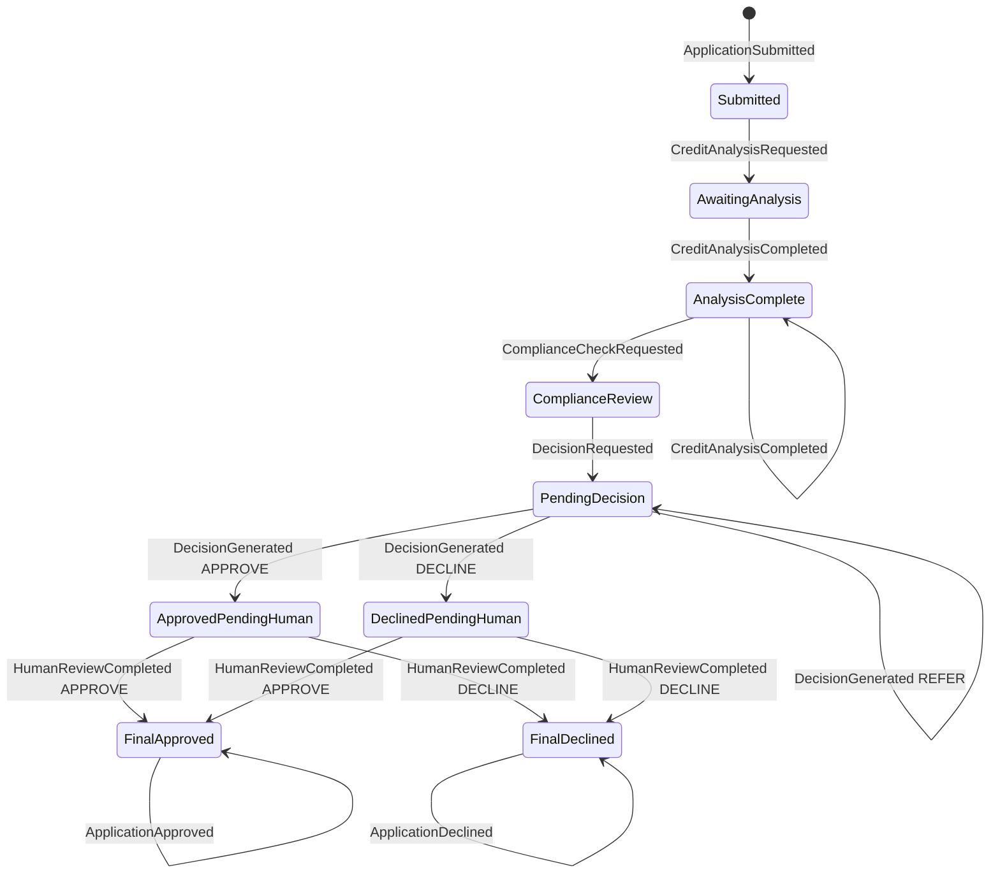

# Aggregates — invariants and replay

Aggregates are rebuilt **only** by replaying their stream (`load` → `_apply` per event). Command handlers validate via **guard methods** before appending; rules here are the source of truth for what replay must support.

## LoanApplicationAggregate (`loan-{application_id}`)

### Invariants (guards)

| Guard | Rule |
|--------|------|
| `assert_new_application_stream` | `version == -1` (no stream yet) before first submit. |
| `assert_awaiting_credit_analysis` | State is `AwaitingAnalysis`, or `AnalysisComplete` **only if** `HumanReviewOverride` set (model churn lock). |
| `assert_decision_recommendation_valid` | If `confidence_score < 0.6`, recommendation must be `REFER`. |
| `assert_compliance_dependency` / `assert_may_append_application_approved` | Every `required_compliance_checks` must appear in compliance stream passes. |
| `effective_decision_recommendation` | Normalizes recommendation + enforces confidence floor before append. |

### State machine (valid transitions)

Defined in code as `VALID_TRANSITIONS` in `loan_application.py`. Invalid transitions raise `DomainError` (`invalid_transition` / `invalid_initial_transition`).

Events that do not change this graph (no-op for state): e.g. `DocumentUploaded`, `FraudScreeningCompleted`, `ComplianceCheckCompleted`.

### Version

`version` tracks `stream_position` when present on replayed events; used as `expected_version` for OCC on append.

---

## AgentSessionAggregate (`agent-{agent_id}-{session_id}`)

### Invariants (guards)

| Guard | Rule |
|--------|------|
| `assert_context_loaded` | **Gas Town:** first real event must be `AgentContextLoaded` (`context_declared_first`). |
| `assert_model_version_current` | Command `model_version` must match session replayed `model_version` when set. |
| `assert_session_processed_application` | Application id must appear in `decision_application_ids` (from decision-trace events). |

### Decision trace event types

`CreditAnalysisCompleted`, `FraudScreeningCompleted`, `ComplianceCheckCompleted`, `DecisionGenerated`, and matching entries inside `AgentOutputWritten.events_written`.

### Stream id parsing

`parse_contributing_stream_id` validates `agent-{agent_id}-{session_id}` for orchestrator causal chain checks.

---

## Tests

Transition and guard behaviour is covered in:

- `tests/test_loan_application_aggregate.py`
- `tests/test_agent_session_aggregate.py`

Run: `pytest tests/test_loan_application_aggregate.py tests/test_agent_session_aggregate.py -q`
